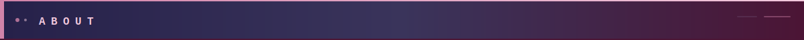
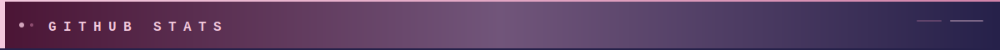
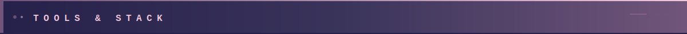
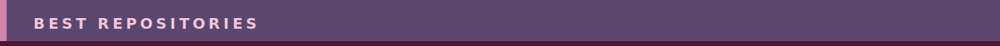
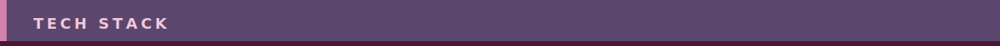
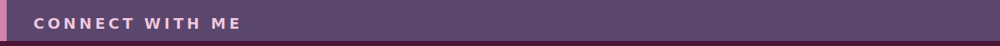
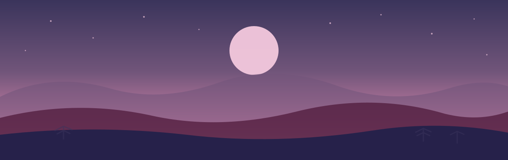

<!--
  ████████████████████████████████████████████████████████████████████████
  ██                                                                    ██
  ██   SHARYAR NAVEED · GITHUB PROFILE README                          ██
  ██   Color Palette: #26214a · #3A345B · #71557A · #D183A9 · #F3C8DD ██
  ██                                                                    ██
  ████████████████████████████████████████████████████████████████████████
-->

<div align="center">



</div>

<div align="center">

<a href="https://github.com/sharyarnaveed">
  
</a>

</div>


<div align="center">

&nbsp;


</div>

<br/>



<br/>

<table>
<tr>
<td width="55%" valign="top">

```
▸ Building and shipping Timetablr end-to-end
  — backend, mobile app, and web landing page

▸ Strong full-stack base across Next.js, Nuxt.js,
  Vue, React Native, Node.js, PHP, and Supabase

▸ Comfortable with payments (Stripe),
  backend-as-a-service (Appwrite, Supabase),
  and REST API design

▸ Picked up Python for data and automation work

▸ Always iterating — I'd rather ship something real
  than perfect something theoretical
```

</td>
<td width="45%" valign="top" align="center">


</td>
</tr>
</table>

<br/>

<div align="center">

**Connect with me**

<a href="mailto:sharyarmalik430@gmail.com"></a>&nbsp;
<a href="https://github.com/sharyarnaveed"></a>

</div>

<br/>


<br/>



<br/>

<div align="center">


</div>

<br/>


<br/>



<br/>

<div align="center">

<br/>


</div>

<br/>


<br/>



<br/>

<div align="center">

&nbsp;

</div>

<br/>


<br/>



<br/>

<div align="center">

<br/>

&nbsp;
&nbsp;
&nbsp;


<br/><br/>

&nbsp;
&nbsp;
&nbsp;


<br/><br/>

&nbsp;
&nbsp;
&nbsp;


</div>

<br/>


<br/>



<br/>

<div align="center">

<a href="mailto:sharyarmalik430@gmail.com"></a>&nbsp;
<a href="https://github.com/sharyarnaveed"></a>

<br/><br/>


<br/><br/>



</div>